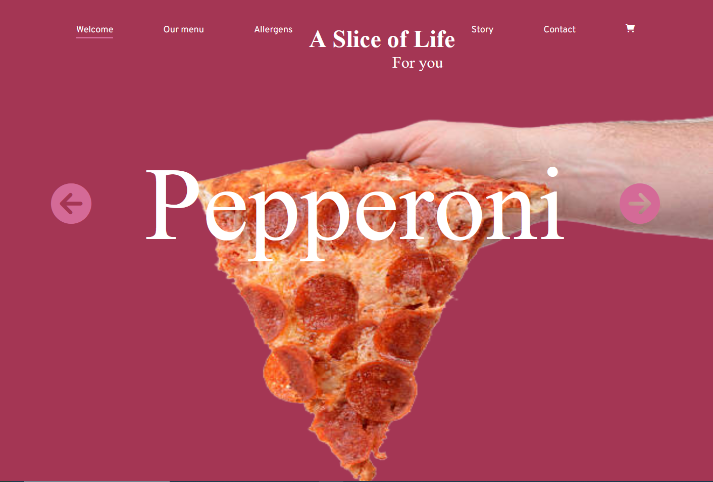

# Pizza Ordering Website - Project

The Pizza Ordering Website is a web application built using JavaScript, CSS, and Express.js that allows users to customize and order pizzas online. Whether you're craving a classic Margherita or a loaded Meat Lovers, this app provides a platform to build your perfect pizza and have it delivered to your doorstep.

# Features

    Pizza Customization: Create your pizza by selecting from various crust types, sauces, cheese, and toppings.

    Order Placement: Add customized pizzas to your cart and proceed to checkout for order placement.

    Real-time Updates: Receive real-time updates on the order status, from preparation to delivery.

# Technologies Used

    Frontend: JavaScript for interactivity and user interface elements, and CSS for styling the website.

    Backend: Express.js for creating a backend server to handle order processing .

# Installation and Usage

To run the Pizza Ordering Website locally, follow these steps:

    Clone this repository to your local machine.
    Navigate to the project directory and install backend dependencies using npm install.
    Set up the connection in the Express.js application.
    Run the backend server using npm start.
    Access the website in your browser at http://localhost:3000.
